# やること
- 最低限のスペックのWindowsServerを立てる
- 作業場所からインターネット経由でリモート接続できること
- 作業場所から以外はリモート接続できないこと

# 手順
## キーペア作成
```
キーペアは、インスタンスへの接続時に身分証明に使用するセキュリティ認証情報のセットであり、プライベートキーとパブリックキーで構成されます。パブリックキーは Amazon EC2 が保存し、プライベートキーはユーザーが保存します。インスタンスに安全にアクセスするには、プライベートキーを使用します。プライベートキーを持つ誰でもがインスタンスに接続できるため、プライベートキーは安全な場所に保存することが重要です。
```

[AWSユーザガイド](https://docs.aws.amazon.com/ja_jp/AWSEC2/latest/WindowsGuide/ec2-key-pairs.html) から引用。

- EC2のネットワーク＆セキュリティ＞キーペアを押す


- 「キーペアを作成」を押す


- 情報入力の上、作成

    - 名前を入力
    - ファイル形式は`pem`を選択
    - 「キーペアを作成」を押す


- キーペアファイルの保存

    - 自動でダウンロードされるので、ファイルを保管する（後で使います）


## インターネットゲートウェイ作成
```
インターネットゲートウェイは、VPC とインターネットとの間の通信を可能にする VPC コンポーネントであり、冗長性と高い可用性を備えており、水平スケーリングが可能です。

インターネットゲートウェイは 2 つの目的を果たします。1 つは、インターネットでルーティング可能なトラフィックの送信先を VPC のルートテーブルに追加することです。もう 1 つは、パブリック IPv4 アドレスが割り当てられているインスタンスに対してネットワークアドレス変換 (NAT) を行うことです。
```

[AWSユーザガイド](https://docs.aws.amazon.com/ja_jp/vpc/latest/userguide/VPC_Internet_Gateway.html)から引用。


- インターネットゲートウェイの作成
    - VISUAL PRIVATE CLOUDのインターネットゲートウェイを押す
    - 「インターネットゲートウェイの作成」を押す


- 情報入力の上、作成
    - 名前タグの入力
    - 「インターネットゲートウェイの作成」を押す


- 作成されたのを確認
    - この時点では、状態が`Detached`。


## VPC作成
```
VPC の主な概念は次のとおりです。

- Virtual Private Cloud (VPC) — AWS アカウント専用の仮想ネットワーク。

- サブネット — VPC の IP アドレスの範囲。

- ルートテーブル — ネットワークトラフィックの経路を判断する際に使用される、ルートと呼ばれる一連のルール。

- インターネットゲートウェイ — VPC 内のリソースとインターネット間の通信を可能にするために VPC にアタッチするゲートウェイ。

- VPC エンドポイント — PrivateLink を使用してサポートされている AWS のサービスや VPC エンドポイントサービスに VPC をプライベートに接続できます。インターネットゲートウェイ、NAT デバイス、VPN 接続、または AWS Direct Connect 接続は必要ありません。VPC のインスタンスは、サービスのリソースと通信するためにパブリック IP アドレスを必要としません。VPC と他のサービス間のトラフィックは、Amazon ネットワークを離れません。詳細については、「VPC エンドポイントおよび VPC エンドポイントサービス (AWS PrivateLink)」を参照してください。
```

[AWSユーザガイド](https://docs.aws.amazon.com/ja_jp/vpc/latest/userguide/what-is-amazon-vpc.html)から引用。

- VPCの作成
    - VISUAL PRIVATE CLOUDのVPCを押す
    - 「VPCの作成」を押す

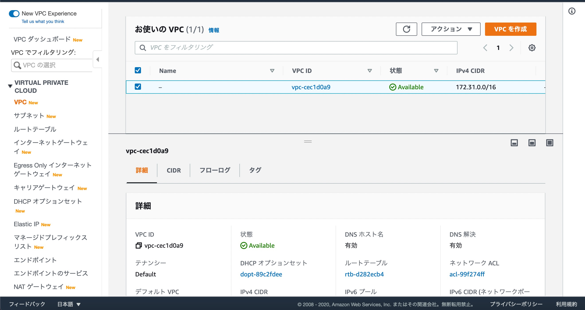

- 情報入力の上、作成
    - 名前タグの入力
    - IPv4 CIDRブロックを入力
    - IPv6 CIDRブロックを選択（ここでは`IPv6 ブロックなし` にする）
    - テナンシーは`デフォルト`のまま（`専有`にすると、「シングルテナントのハードウェアでインスタンスが確実に動作することが保証されます。」）
    - 「VPCを作成」を押す

参照：[IPv4 用の VPC とサブネットのサイズ設定](https://docs.aws.amazon.com/ja_jp/vpc/latest/userguide/VPC_Subnets.html#vpc-sizing-ipv4)

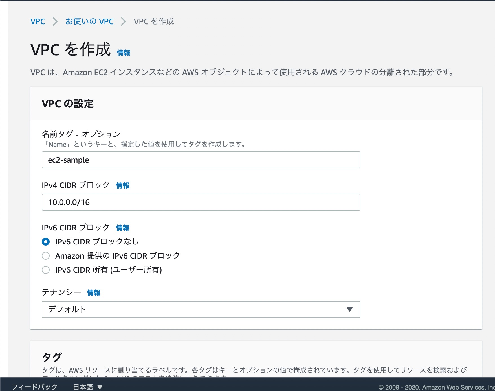
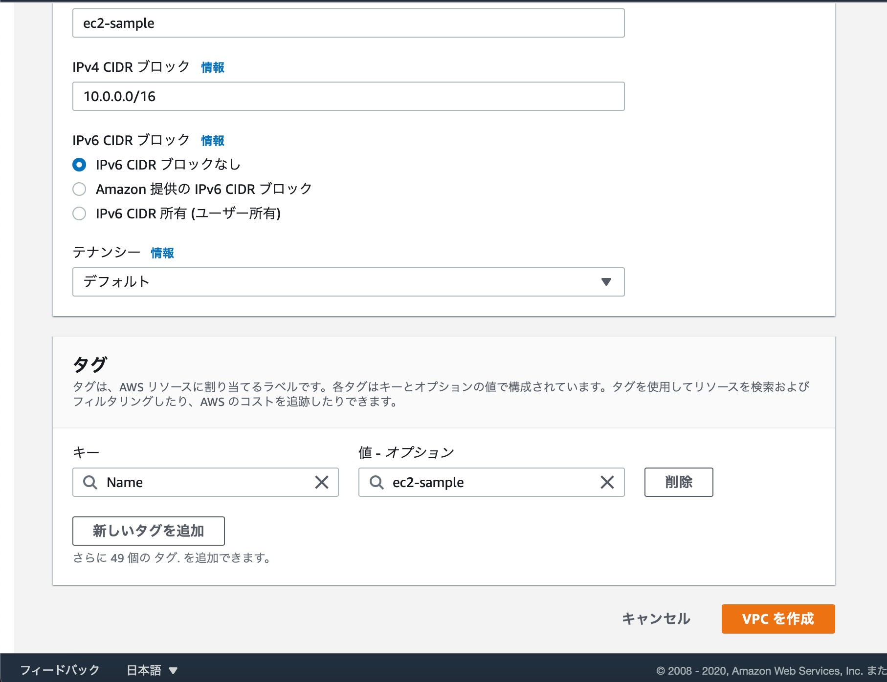

- 作成されたのを確認

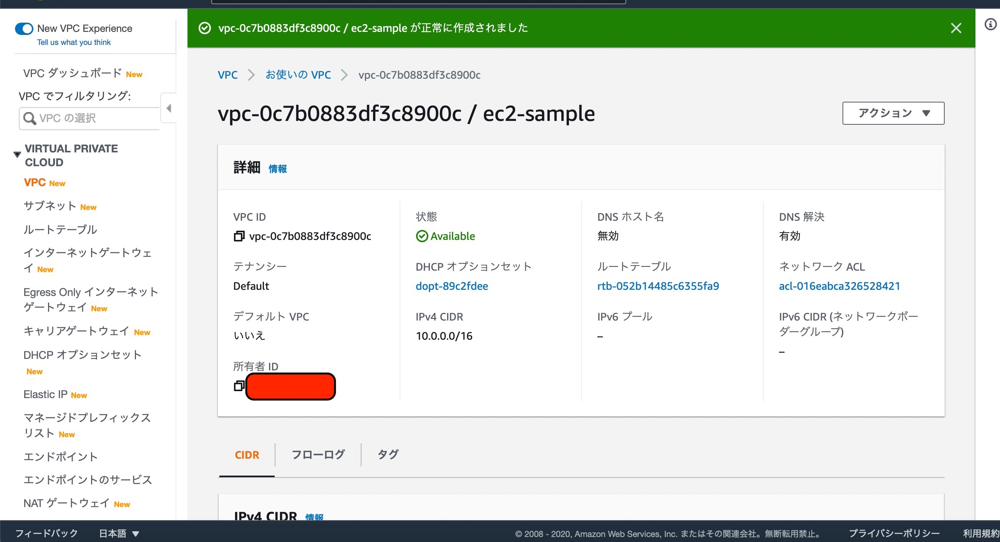

## インターネットゲートウェイのアタッチ
- インターネットゲートウェイの一覧を表示


- VPCのアタッチ
    - インターネットゲートウェイを選択
    - アクションから`VPCをアタッチ`を選択

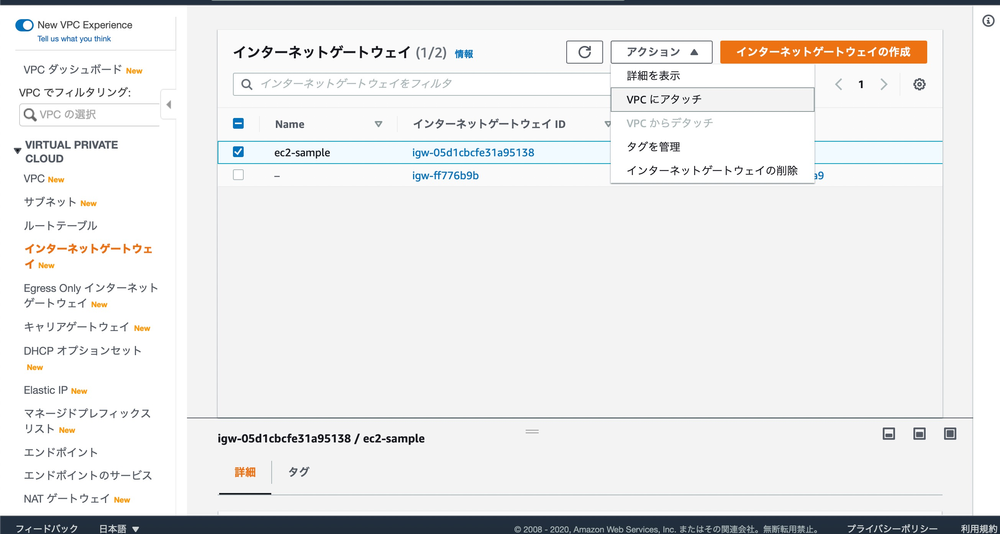

- 情報入力の上、作成
    - 使用可能なVPCを選択。（先ほど作成したVPCを選択）
    - 「インターネットゲートウェイのアタッチ」を押す

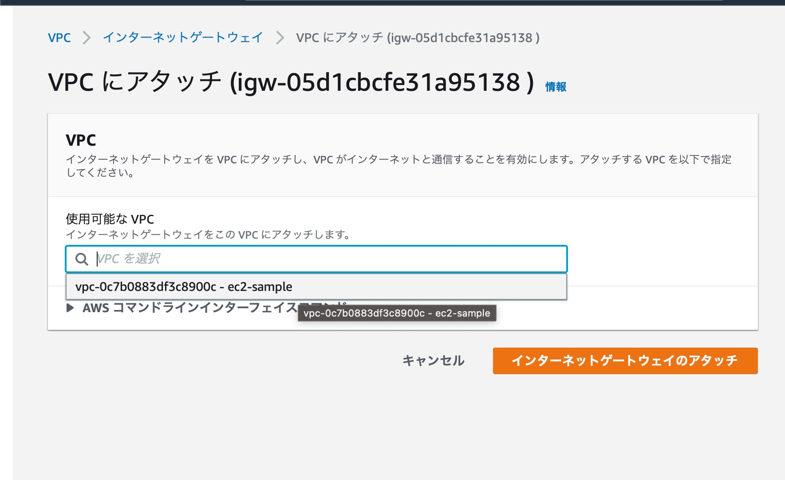


- アタッチされたのを確認
    - この時点では、状態が`Attached`。

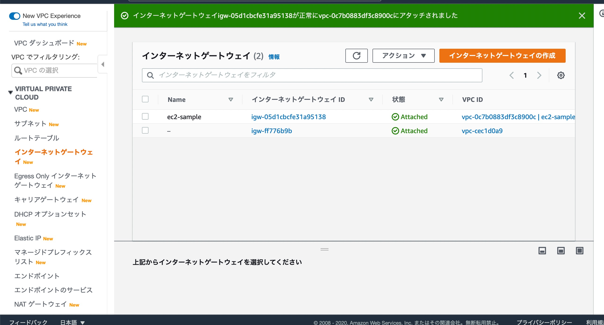


## サブネット作成
```
サブネットは、VPC の IP アドレスの範囲です。AWS リソースは、指定したサブネット内に起動できます。インターネットに接続する必要があるリソースにはパブリックサブネットを、インターネットに接続しないリソースにはプライベートサブネットを使用してください。
```

[AWSユーザガイド](https://docs.aws.amazon.com/ja_jp/vpc/latest/userguide/how-it-works.html#how-it-works-subnet)から引用。

[VPCとサブネット](https://docs.aws.amazon.com/ja_jp/vpc/latest/userguide/VPC_Subnets.html#vpc-subnet-basics)

- サブネットの作成
    - VISUAL PRIVATE CLOUDのサブネットを押す
    - 「サブネットの作成」を押す

- 情報入力の上、作成
    - VPC IDの選択 → サブネットの設定ができるようになる
    - サブネット名の入力
    - アベイラビリティゾーンの選択（ここでは`指定なし`）
    - IPv4 CIDRブロックの入力
    - 「サブネットを作成」を押す


- 作成されたのを確認


## ルートテーブルの編集
```
VPC には暗黙的なルーターがあり、ルートテーブルを使用してネットワークトラフィックの送信先を制御します。VPC の各サブネットをルートテーブルに関連付ける必要があり、ルートテーブルはサブネットのルーティング（サブネットルートテーブル）を制御します。サブネットを特定のルートテーブルに明示的に関連付けることができます。それ以外の場合、サブネットはメインルートテーブルに暗黙的に関連付けられます。1 つのサブネットは同時に 1 つのルートテーブルにしか関連付けることはできませんが、複数のサブネットを同じサブネットルートテーブルに関連付けることはできます。
```

[AWSユーザガイド](https://docs.aws.amazon.com/ja_jp/vpc/latest/userguide/VPC_Route_Tables.html)から引用。


- ルートの追加
    - サブネットからルートテーブルをクリック
    - ルートテーブルを表示
    - ルートタブを選択
    - 「ルートの編集」を押す


- ターゲットの選択
    - 「ルートの追加」を押す
    - ターゲットのドロップダウンリストを開く
    - `Internet Gateway`を選択
    - 作成したインターネットゲートウェイを選択
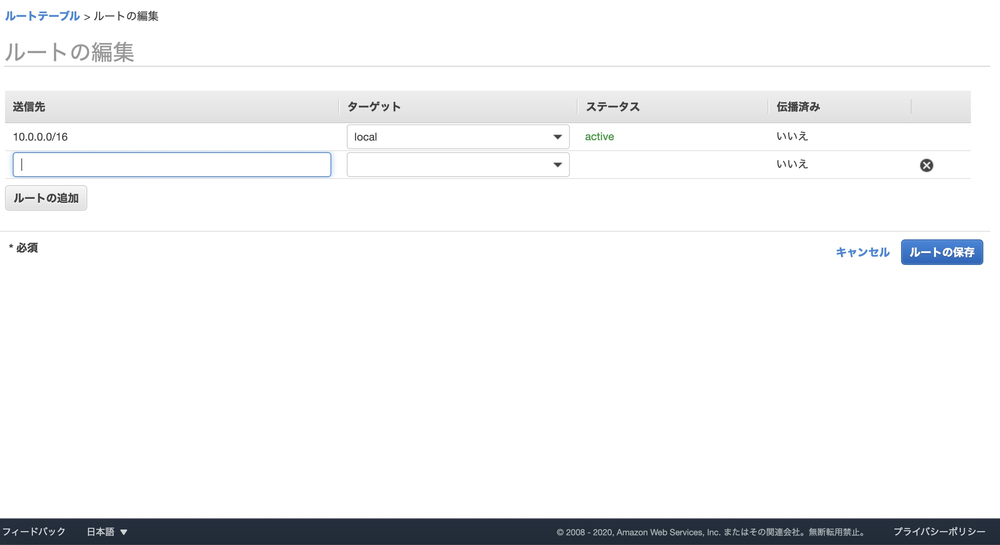


- 送信先の入力
    - 送信先に、`0.0.0.0/0`を入力。
    - 「ルートの保存」を押す
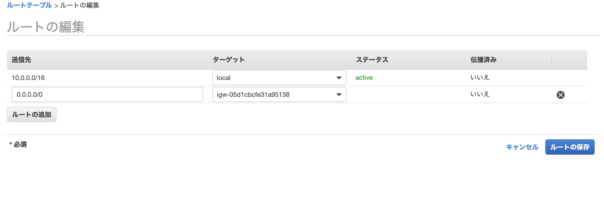
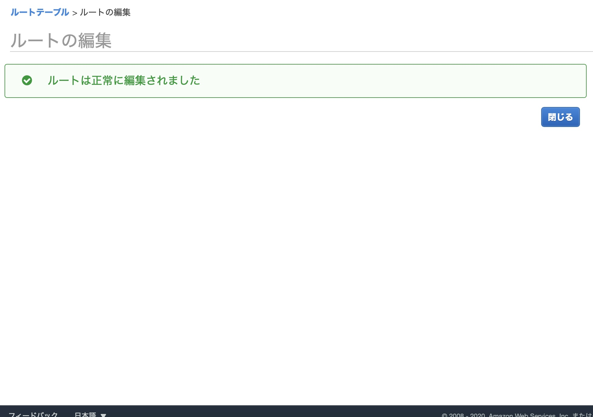

- 作成されたのを確認


## EC2作成
```
Amazon Elastic Compute Cloud (Amazon EC2) は、アマゾン ウェブ サービス (AWS) クラウドでスケーラブルなコンピューティングキャパシティーを提供します。Amazon EC2 の使用により、ハードウェアに事前投資する必要がなくなり、アプリケーションをより速く開発およびデプロイできます。Amazon EC2 を使用して必要な数 (またはそれ以下) の仮想サーバーを起動して、セキュリティおよびネットワーキングの設定と、ストレージの管理を行います。Amazon EC2 では、要件変更や需要増に対応して迅速に拡張または縮小できるため、サーバートラフィック予測が不要になります。
```

[AWSユーザガイド](https://docs.aws.amazon.com/ja_jp/AWSEC2/latest/WindowsGuide/concepts.html)から引用。

### EC2の作成
- EC2ダッシュボードのインスタンスを押す
- 「インスタンスを起動」を押す
- 「インスタンスを起動」を選択

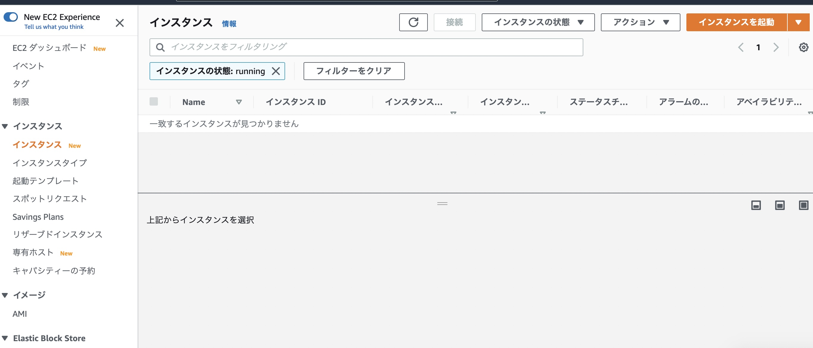

### AMIの選択
```
Amazon マシンイメージ (AMI) には、インスタンスの起動に必要な情報が用意されています。インスタンスを起動するときは、AMI を指定する必要があります。同じ設定で複数のインスタンスが必要な場合は、1 つの AMI から複数のインスタンスを起動できます。さまざまな設定のインスタンスが必要なときは、各インスタンスをそれぞれ異なる AMI から起動できます。
```
[AWSユーザガイド](https://docs.aws.amazon.com/ja_jp/AWSEC2/latest/WindowsGuide/AMIs.html)から引用。

- `Microsoft Windows Server 2019 Base`の選択を押す
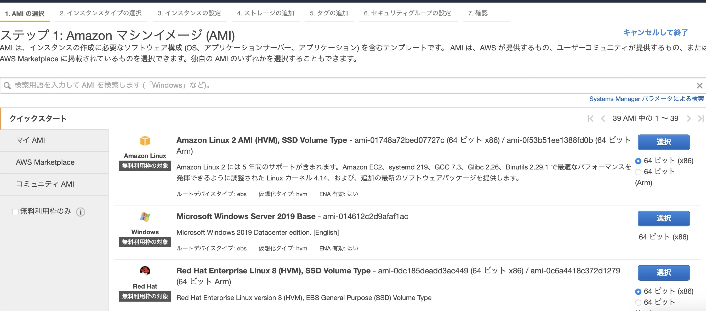

### インスタンスタイプの選択
```
インスタンスを起動するときは、指定したインスタンスタイプによって、インスタンスに使用するホストコンピュータのハードウェアが決まります。インスタンスタイプごとに、コンピューティング、メモリ、およびストレージの機能は異なり、これらの機能に基づいてインスタンスファミリーにグループ分けされます。インスタンスタイプは、インスタンス上で実行するアプリケーションやソフトウェアの要件に基づいて選択します。
```
[AWSユーザガイド](https://docs.aws.amazon.com/ja_jp/AWSEC2/latest/WindowsGuide/instance-types.html)から引用。

- `t2.micro`にチェックを入れる
- 「次のステップ：インスタンスの詳細の設定」を押す


### インスタンスの詳細の設定
- ネットワークに、作成したVPCを選択
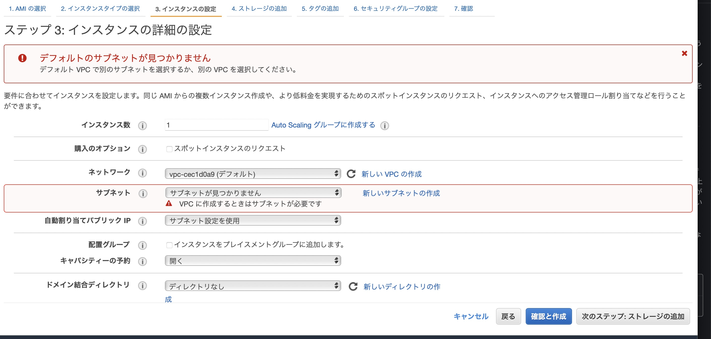
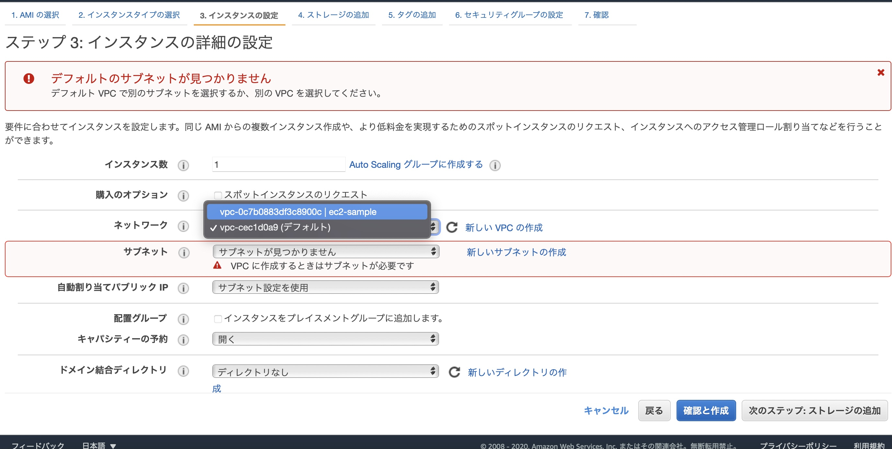

- 作成したサブネットを選択


- 自動割り当てパブリックIPで`有効`を選択


- キャパシティの予約で`なし`を選択


- ネットワークインターフェイスは何もしない（プライベートIPの指定も可能）
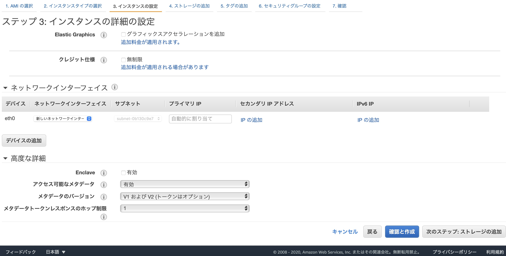

- 「次のステップ：ストレージの追加」を押す

### ストレージの追加
```
Amazon EC2 にはインスタンスを格納するための、柔軟で使いやすく、コスト効率の良いデータストレージオプションが用意されています。各オプションは独自のパフォーマンスと耐久性を備えています。これらのストレージオプションは、要件に応じて個別に使用することも、組み合わせて使用することもできます。
```
[AWSユーザガイド](https://docs.aws.amazon.com/ja_jp/AWSEC2/latest/WindowsGuide/Storage.html)から引用。

- 何も変更しない
- 「次のステップ：タグの追加」を押す


### タグの追加
- つけたい名前をつける
- 「次のステップ：セキュリティグループの設定」を押す


### セキュリティグループの設定

```
Amazon EC2 にはインスタンスを格納するための、柔軟で使いやすく、コスト効率の良いデータストレージオプションが用意されています。各オプションは独自のパフォーマンスと耐久性を備えています。これらのストレージオプションは、要件に応じて個別に使用することも、組み合わせて使用することもできます。
```
[AWSユーザガイド](https://docs.aws.amazon.com/ja_jp/AWSEC2/latest/WindowsGuide/ec2-security-groups.html)から引用。

- タイプRDPの明細を編集
- ソースを`カスタム`を選択
- IPアドレスに`xxx.xxx.xxx.xxx/32`を入力（ipconfig.meで確認する）
- 説明に任意の文字（ここでは`from rdp`）を入力
- 「確認と作成」を押す


### インスタンス作成の確認
- 作成内容を確認
- 「起動」を押す
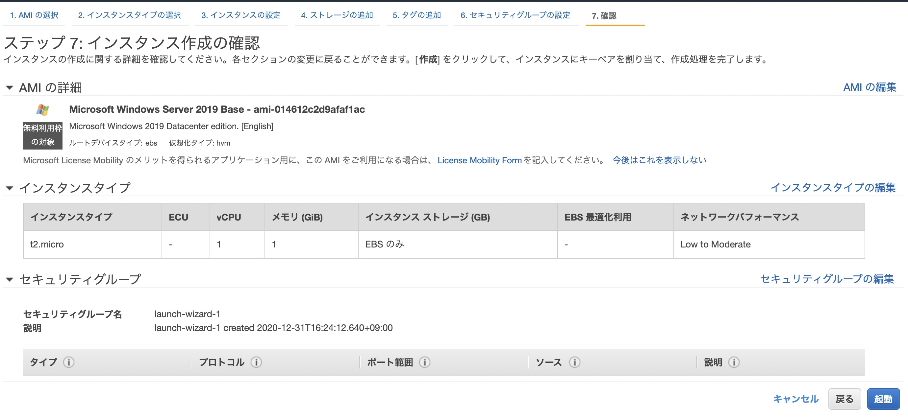
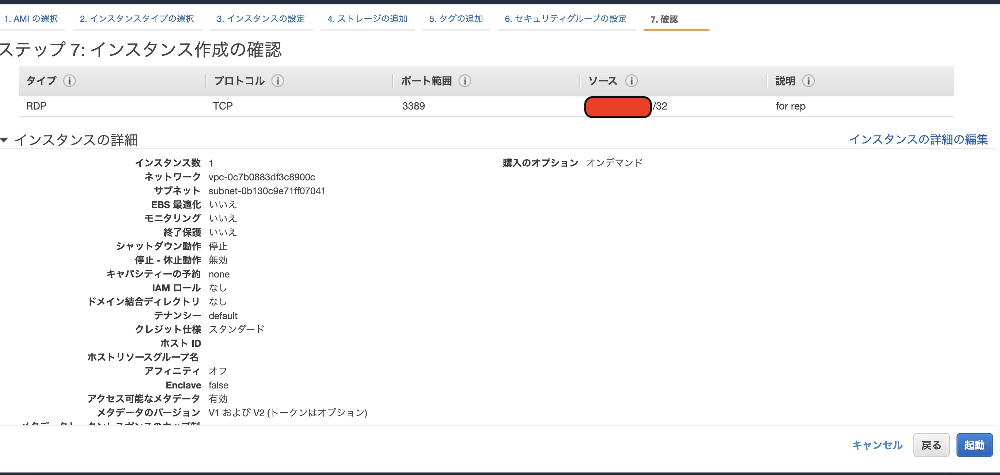
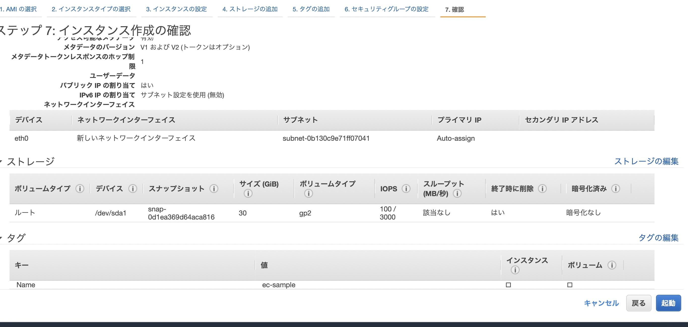

### キーペアを選択
- 「既存のキーペアを選択」を選択
- キーペアを選択で、作成したキーペアを選択


- 選択したプライベートファイル〜のチェックをONにする
- 「インスタンスの作成」を押す


### 使えるようになるまで待つ
- 作成ステータスの、IDを選択
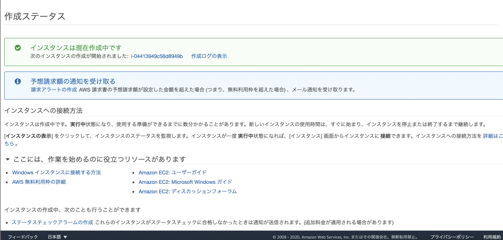

- ステータスチェックで、初期化が終わると、使えるようになる。
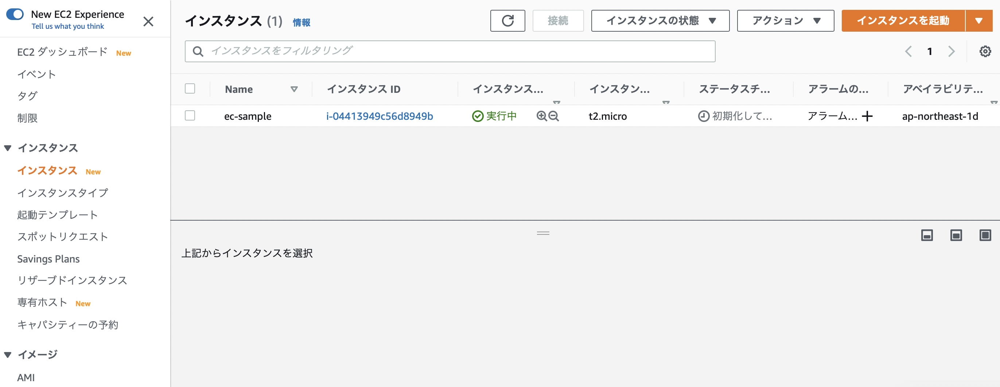
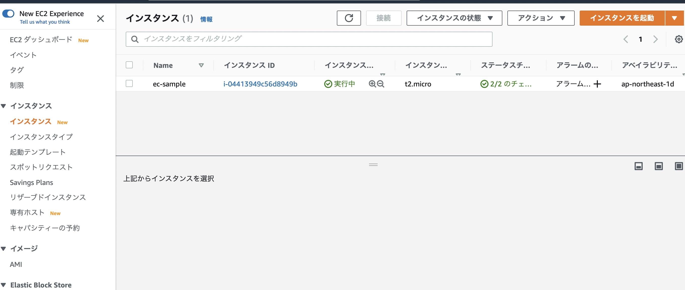


# WindowsServerへ接続
- IPアドレスの確認
    - EC2のインスタンスIDを選択
    - インスタンス概要のパブリックIPアドレスを控える
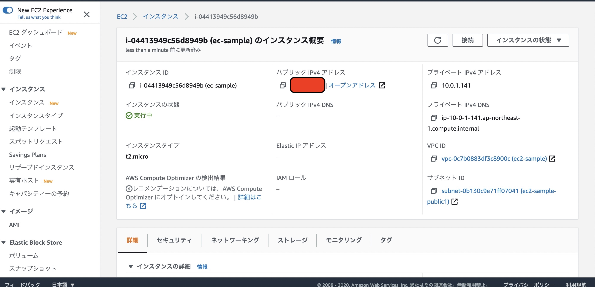

- Administratorのパスワードを確認
    - インスタンス概要の「接続」ボタンを押す
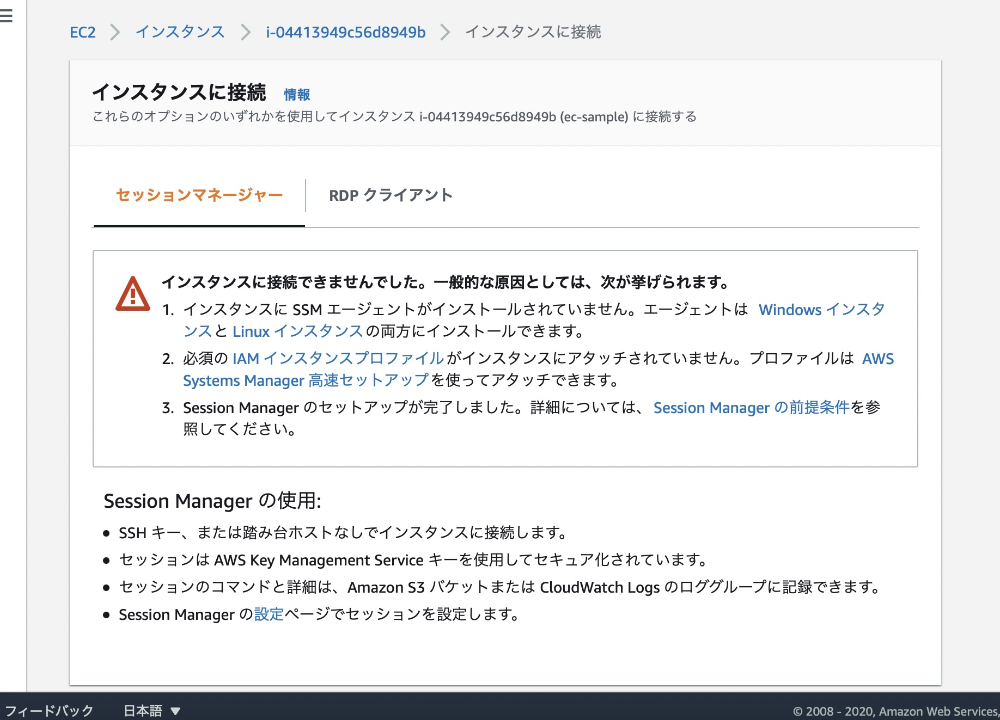
    - RDPクライアントタブを押す
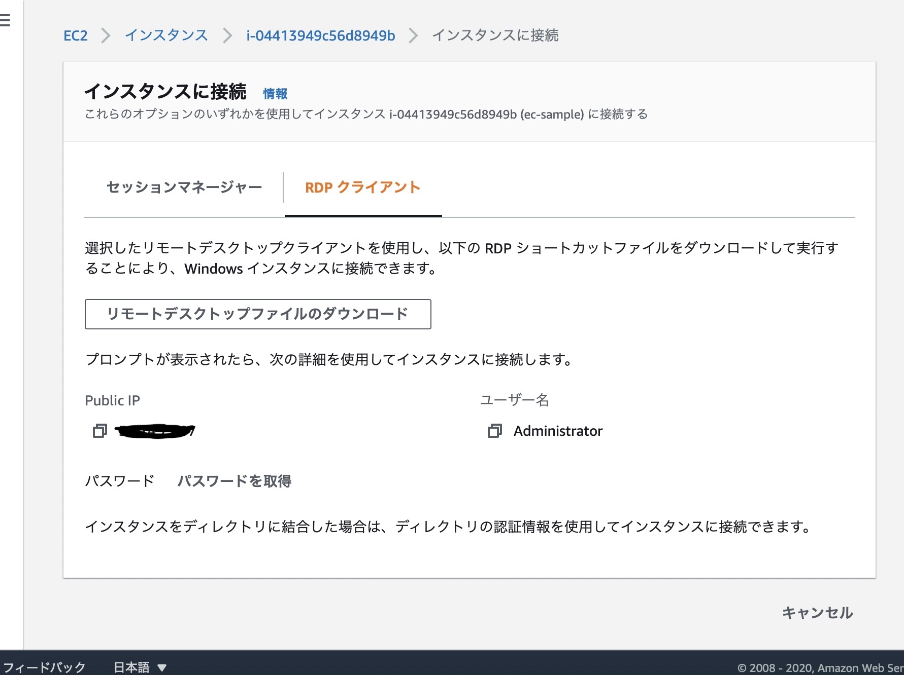
    - 「パスワードを取得」リンクを押す
    - ダウンロードされているキーペアをエディタで開き、テキストボックスに貼り付ける
    - 「パスワードを復号化」を押す

    - パスワードが表示されるので、控える


- リモートデスクトップ接続する
    - IPアドレス、パスワードを使用して、リモートデスクトップ接続する（スクリーンショットは、MacOSのMicrosoft Remote Desktopアプリを使用)


    - 接続成功！
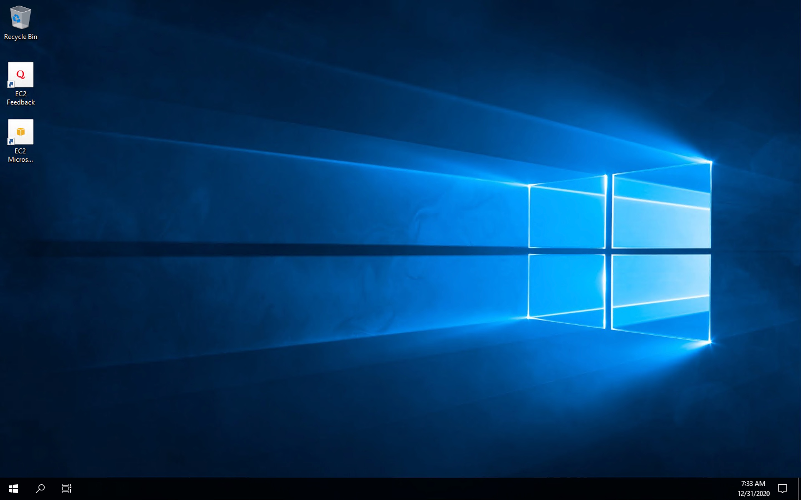
