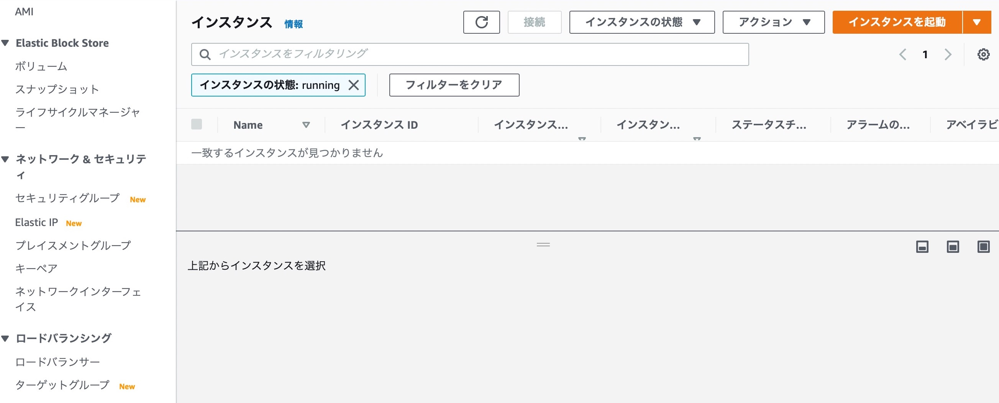

# やること
- 最低限のスペックのWindowsServerを立てる
- 家からインターネット経由でリモート接続できること
- 家から以外はリモート接続できないこと

# 手順
## キーペア作成
```
キーペアは、インスタンスへの接続時に身分証明に使用するセキュリティ認証情報のセットであり、プライベートキーとパブリックキーで構成されます。パブリックキーは Amazon EC2 が保存し、プライベートキーはユーザーが保存します。インスタンスに安全にアクセスするには、プライベートキーを使用します。プライベートキーを持つ誰でもがインスタンスに接続できるため、プライベートキーは安全な場所に保存することが重要です。
```

[AWSユーザガイド](https://docs.aws.amazon.com/ja_jp/AWSEC2/latest/WindowsGuide/ec2-key-pairs.html) から引用。

- EC2のネットワーク＆セキュリティ＞キーペアを押す



- 「キーペアを作成」を押す


- 情報入力の上、作成

    - 名前を入力
    - ファイル形式は`pem`を選択
    - 「キーペアを作成」を押す


- キーペアファイルの保存

    - 自動でダウンロードされるので、ファイルを保管する（後で使います）


# インターネットゲートウェイ作成
```
インターネットゲートウェイは、VPC とインターネットとの間の通信を可能にする VPC コンポーネントであり、冗長性と高い可用性を備えており、水平スケーリングが可能です。

インターネットゲートウェイは 2 つの目的を果たします。1 つは、インターネットでルーティング可能なトラフィックの送信先を VPC のルートテーブルに追加することです。もう 1 つは、パブリック IPv4 アドレスが割り当てられているインスタンスに対してネットワークアドレス変換 (NAT) を行うことです。
```

[AWSユーザガイド](https://docs.aws.amazon.com/ja_jp/vpc/latest/userguide/VPC_Internet_Gateway.html)から引用。


- インターネットゲートウェイの作成
    - VPC(VISUAL PRIVATE CLOUD)のインターネットゲートウェイを押す
    - 「インターネットゲートウェイの作成」を押す


- 情報入力の上、作成
    - 名前タグの入力
    - 「インターネットゲートウェイの作成」を押す


- 作成されたのを確認
    - この時点では、状態が`Detached`。


