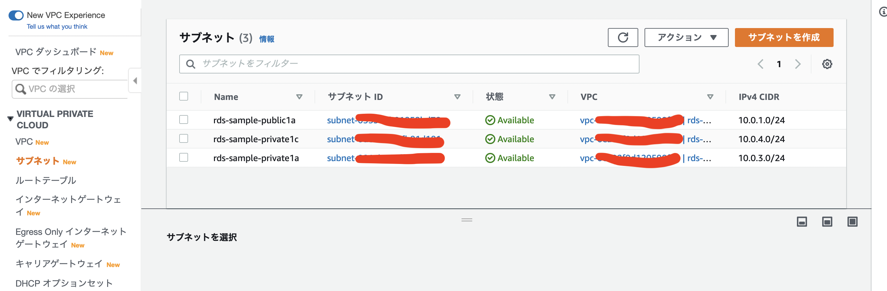
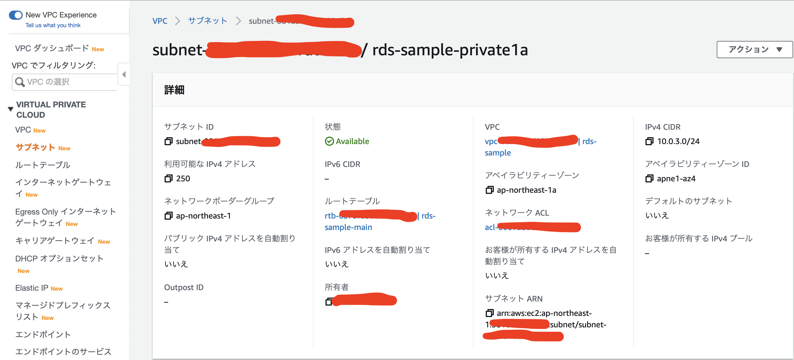
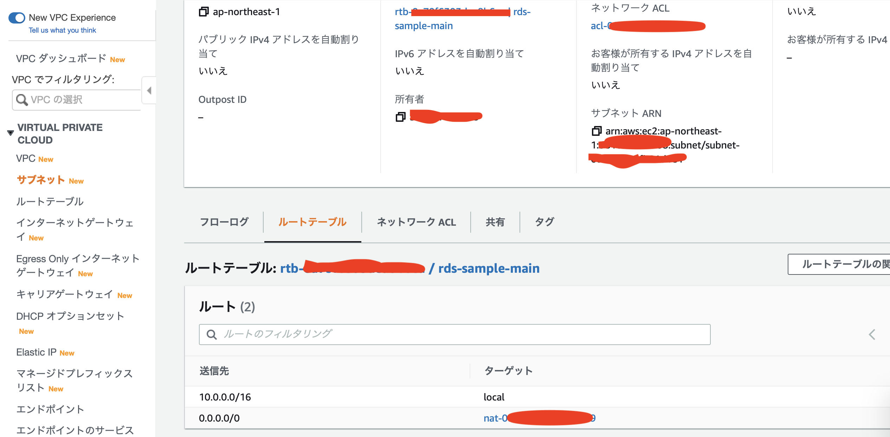
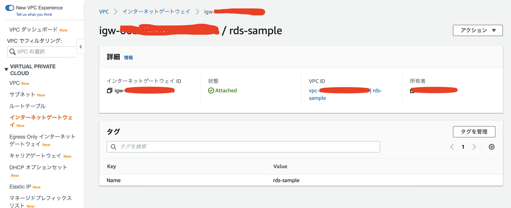
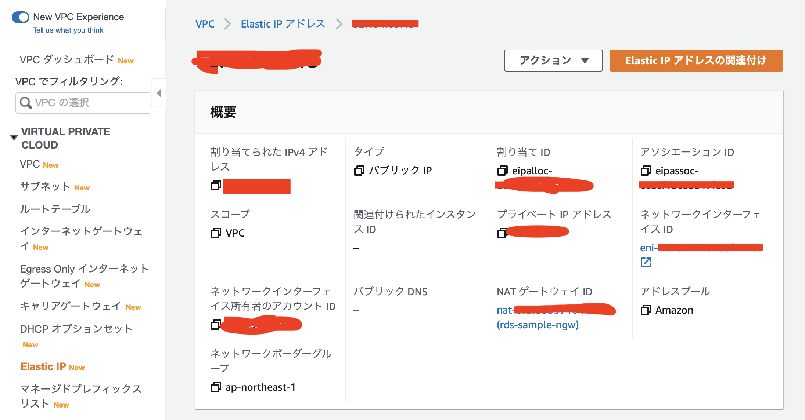
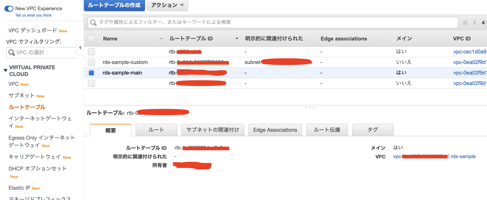
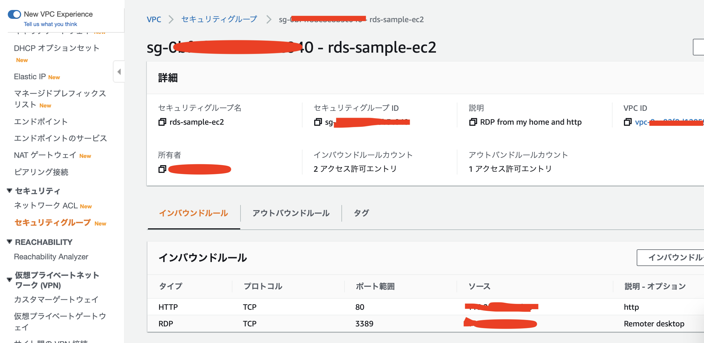
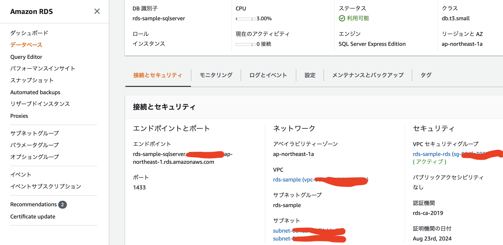
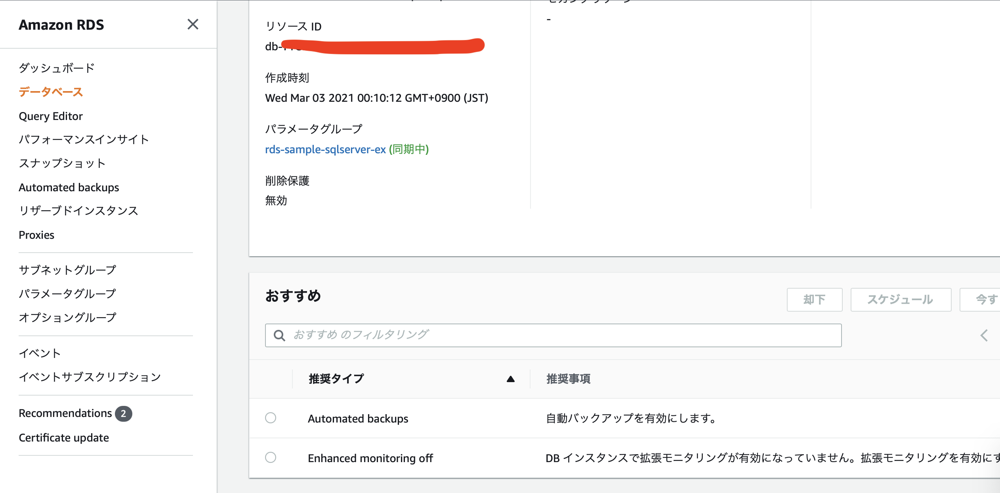
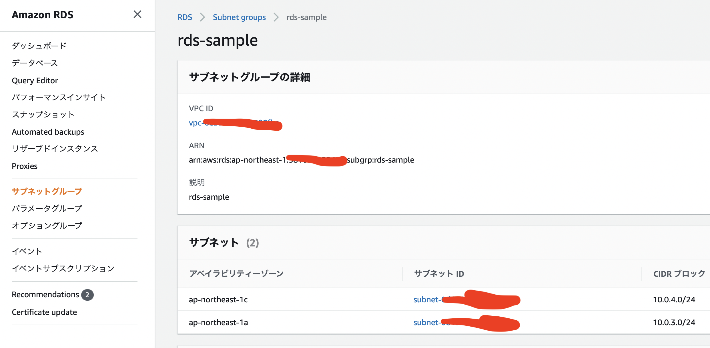

# やること
- 最低限のスペックのWindowsServerを立てる
- 作業場所からEC2にインターネット経由でリモート接続できること
- RDSにEC2経由で接続できること

## 参考
[チュートリアル: DB インスタンス用の Amazon VPC を作成する](https://docs.aws.amazon.com/ja_jp/AmazonRDS/latest/UserGuide/CHAP_Tutorials.WebServerDB.CreateVPC.html)

# 手順
## VPC作成

## サブネット作成

### パブリックサブネット

### プライベートサブネット
RDSでサブネットグループを指定する必要があるため2つ作成。

## インターネットゲートウェイ

## NATゲートウェイ

## ルートテーブルの編集
### カスタムルートテーブル
インターネットゲートウェイへのルートを追加し、パブリックサブネットに関連付け。

### メインルートテーブル
NATゲートウェイへのルートを追加。

## セキュリティグループ
### EC2用 

### RDS用

## EC2

## RDS

